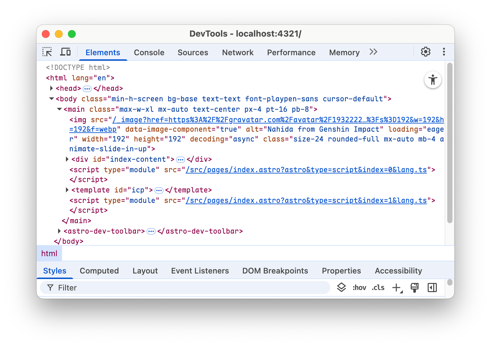
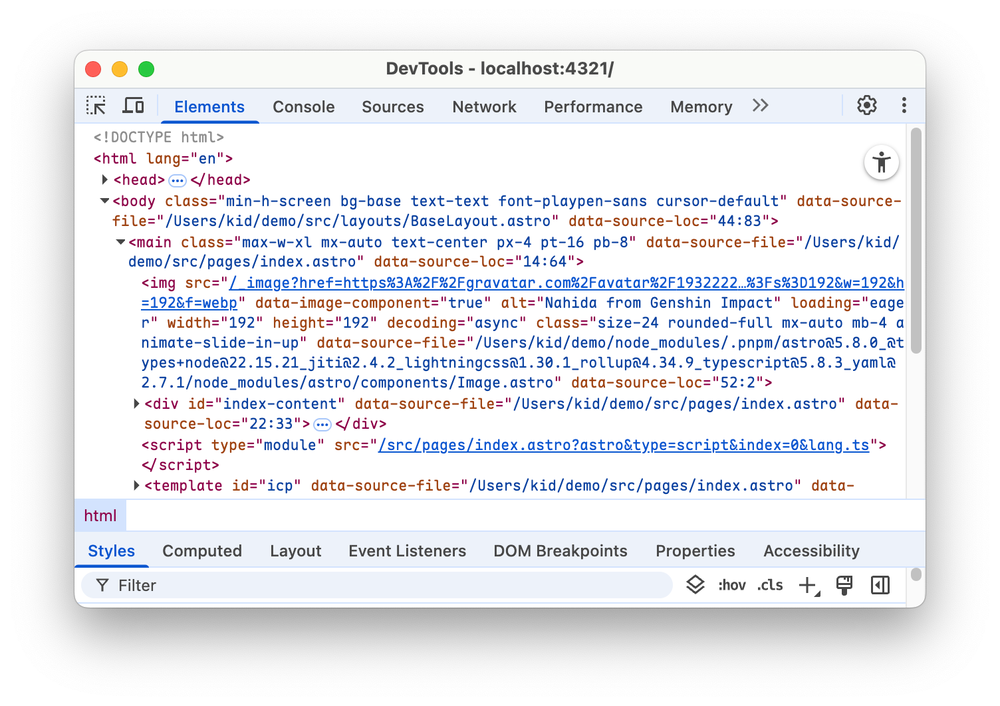

# Astro Source File

> Bring back `[data-astro-source-file]` [removed in Astro 5.7.0](https://github.com/withastro/astro/pull/13602)

|Before||
|-|-|
|**After**||

## Usage

1. Install

   ```sh
   npm install @kidonng/astro-source-file
   ```

2. Add component to your Astro layout

   ```astro
   ---
   import AstroSourceFile from '@kidonng/astro-source-file'
   ---
 
   <AstroSourceFile />
   ```

3. Profit!
